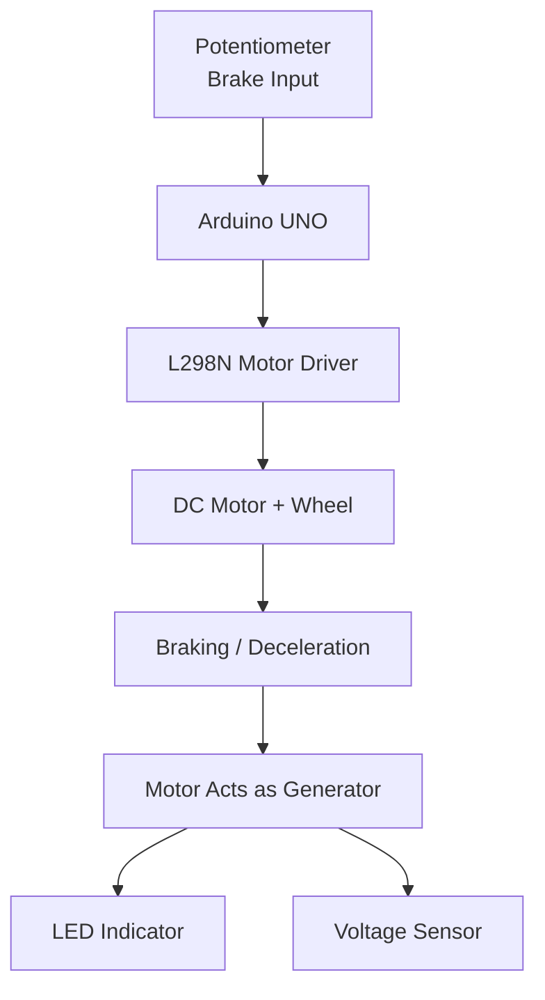
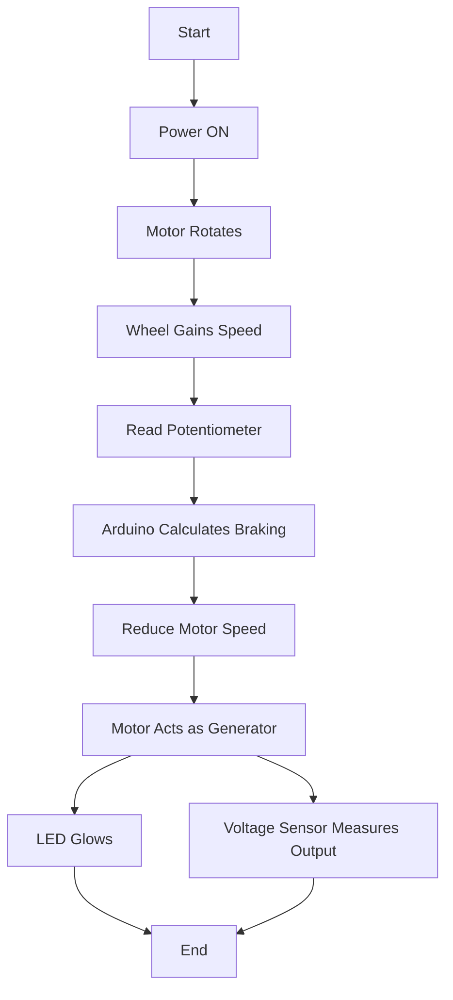

# Driver-Intent-Based Regenerative Braking System using Arduino

> **A prototype demonstrating how braking behavior affects the energy of a moving system and how rotational energy can be converted into electrical energy during braking.**

---

# Project Overview

This project demonstrates the **working principle of regenerative braking** using an Arduino-based prototype.

Unlike a simple motor speed control project, this system focuses on **how driver braking behavior influences the motion of a rotating system and how energy can be generated while slowing it down.**

The DC motor represents a vehicle wheel. As the wheel rotates, it possesses **kinetic energy**. When braking is applied through a potentiometer (acting as a brake pedal), the Arduino interprets the braking intensity and reduces the motor speed accordingly.

During deceleration, the motor continues spinning due to inertia. At this stage, it behaves like a small generator and produces electrical energy. This generated energy is visually indicated using an LED, while a voltage sensor provides measurable electrical data.

This prototype demonstrates the **concept** of regenerative braking rather than implementing a complete battery charging system.

## 🎥 Project Demonstration

A short demonstration video showing the complete operation of the Driver-Intent-Based Regenerative Braking System, including motor operation, driver-controlled braking using the potentiometer, LED indication during regenerative braking, and the overall working prototype.

Watch the complete working demonstration of the project here:

**YouTube Demo:** https://youtu.be/zaUXHkkjzvo

---

# Objectives

* Demonstrate the principle of regenerative braking.
* Simulate driver-controlled braking using a potentiometer.
* Show the effect of braking intensity on motor speed.
* Demonstrate electrical energy generation during deceleration.
* Measure electrical behavior using a voltage sensor.
* Provide a simple educational prototype explaining energy recovery concepts.

---

# Working Principle

## Step 1 – Vehicle Motion Simulation

The DC motor is connected to a wheel and powered through the L298N Motor Driver.

When power is supplied:

* Motor rotates.
* Wheel spins.
* Rotational motion represents a moving vehicle.
* Higher speed means higher kinetic energy.

---

## Step 2 – Driver Brake Input

A potentiometer acts as the brake pedal.

Different positions represent different braking levels.

For example:

| Potentiometer Position | Meaning      |
| ---------------------- | ------------ |
| Low                    | No Brake     |
| Medium                 | Gentle Brake |
| High                   | Strong Brake |

The Arduino continuously reads this value.

---

## Step 3 – Driver Intent Based Control

Instead of stopping the motor instantly, the Arduino adjusts the PWM signal according to the brake input.

This means:

* Light braking → gradual speed reduction
* Medium braking → moderate speed reduction
* Heavy braking → rapid speed reduction

This is why the project is called **Driver-Intent-Based Regenerative Braking**.

The braking action depends on **driver input**, not a fixed program.

---

## Step 4 – Inertia

Even after motor power is reduced, the wheel does not stop immediately.

Because of inertia,

the wheel continues rotating for a short duration.

This remaining rotation is what enables energy generation.

---

## Step 5 – Energy Generation

While slowing down, the spinning motor behaves like a generator.

Instead of consuming electrical power,

it begins producing a small electrical voltage.

This demonstrates the basic principle behind regenerative braking used in electric vehicles.

---

## Step 6 – LED Indication

The generated voltage passes through a diode and reaches an LED.

During braking,

the LED glows or flickers,

indicating that electrical energy is being generated.

This serves as the visual proof of regeneration.

---

## Step 7 – Voltage Measurement

A voltage sensor monitors the electrical behavior.

During normal motor operation:

* Voltage remains relatively steady.

During braking:

* Electrical conditions change.
* Generated voltage can be observed.
* Sensor readings confirm the electrical activity.

Thus,

* LED = Visual proof
* Voltage Sensor = Numerical proof

---

# Hardware Components

| Component             | Quantity    |
| --------------------- | ----------- |
| Arduino UNO           | 1           |
| L298N Motor Driver    | 1           |
| DC Geared Motor       | 1           |
| Wheel                 | 1           |
| Potentiometer (10kΩ)  | 1           |
| Voltage Sensor Module | 1           |
| LED                   | 1           |
| Diode                 | 1           |
| Breadboard            | 1           |
| Jumper Wires          | As Required |
| External Power Supply | 1           |

---

# Software Used

* Arduino IDE
* Embedded C / Arduino Programming

---

# System Architecture

# Flow of Operation

# Circuit Description

The Arduino reads the potentiometer value through an analog input.

According to the brake position, it generates a PWM signal to control the L298N motor driver.

The motor driver powers the DC motor.

As braking increases, the Arduino reduces PWM duty cycle, decreasing motor speed.

During deceleration, the rotating motor generates a small voltage.

This generated voltage passes through a diode to protect the circuit and drives an LED.

A voltage sensor monitors the electrical behavior during this process.

## Complete Working Setup

---

# Understanding the Prototype

This prototype is designed to demonstrate the **concept** of regenerative braking rather than replicate the exact behavior of a commercial electric vehicle.

Some observations include:

### Very Fast Wheel

The wheel accelerates and decelerates rapidly because:

* It is lightweight.
* There is almost no mechanical load.
* Rotational inertia is very small.

Real vehicles have significantly greater mass, causing braking and energy recovery to occur more gradually.

---

### Small Generated Energy

The generated electrical energy is relatively small because:

* The motor is small.
* The wheel has limited inertia.
* The braking duration is short.

Despite this, the LED and voltage sensor clearly demonstrate that energy is produced during deceleration.

---

## The Overall Demo

---

# Why the Battery is Not Used

Although a lithium-ion battery is physically placed on the prototype board, **it is intentionally not connected to the regenerative braking circuit and does not participate in the operation of the project**.

Its presence is only for demonstration purposes to represent the battery found in a real electric vehicle.

In an actual EV:

* Energy generated during braking is converted and regulated using power electronic converters.
* A Battery Management System (BMS) ensures safe charging.
* The recovered energy is stored in the lithium-ion battery.

Implementing safe battery charging requires additional hardware such as DC-DC converters, charging circuits, current limiting, voltage regulation, and battery protection, which are beyond the scope of this educational prototype.

For stable operation, this project instead uses an external power supply for the motor and Arduino, while the generated energy is demonstrated using the LED and voltage sensor.

---

# Advantages

* Simple and low-cost prototype.
* Easy to understand.
* Demonstrates regenerative braking principles.
* Shows driver-controlled braking.
* Provides visual and measurable outputs.
* Useful for academic demonstrations.

---

# Limitations

* No actual battery charging.
* Small generated voltage.
* Lightweight wheel differs from real vehicles.
* Prototype demonstrates concept only.
* Not intended for practical energy recovery applications.

---

# Future Improvements

* Add supercapacitor energy storage.
* Implement lithium-ion battery charging with a proper BMS.
* Display real-time voltage and current on an LCD or OLED.
* Log sensor data to an SD card.
* Use a BLDC motor for higher efficiency.
* Estimate recovered energy and efficiency.
* Add wireless monitoring using Bluetooth or Wi-Fi.

---

# Expected Output

* Motor rotates normally.
* Wheel represents vehicle motion.
* Potentiometer changes braking intensity.
* Arduino adjusts motor speed.
* Wheel slows according to braking input.
* Motor generates a small electrical voltage while slowing down.
* LED glows or flickers during regeneration.
* Voltage sensor readings change during braking.

---

# Conclusion

This project successfully demonstrates the fundamental principle of **driver-intent-based regenerative braking**. By allowing the user to vary braking intensity using a potentiometer, the Arduino dynamically controls motor deceleration. As the motor slows due to inertia, it produces electrical energy that is indicated through an LED and monitored by a voltage sensor. Although the generated energy is not stored in a battery, the prototype effectively illustrates how regenerative braking converts a portion of a moving system's kinetic energy into electrical energy. The setup serves as an educational model for understanding the core concepts of regenerative braking used in electric vehicles.

---

